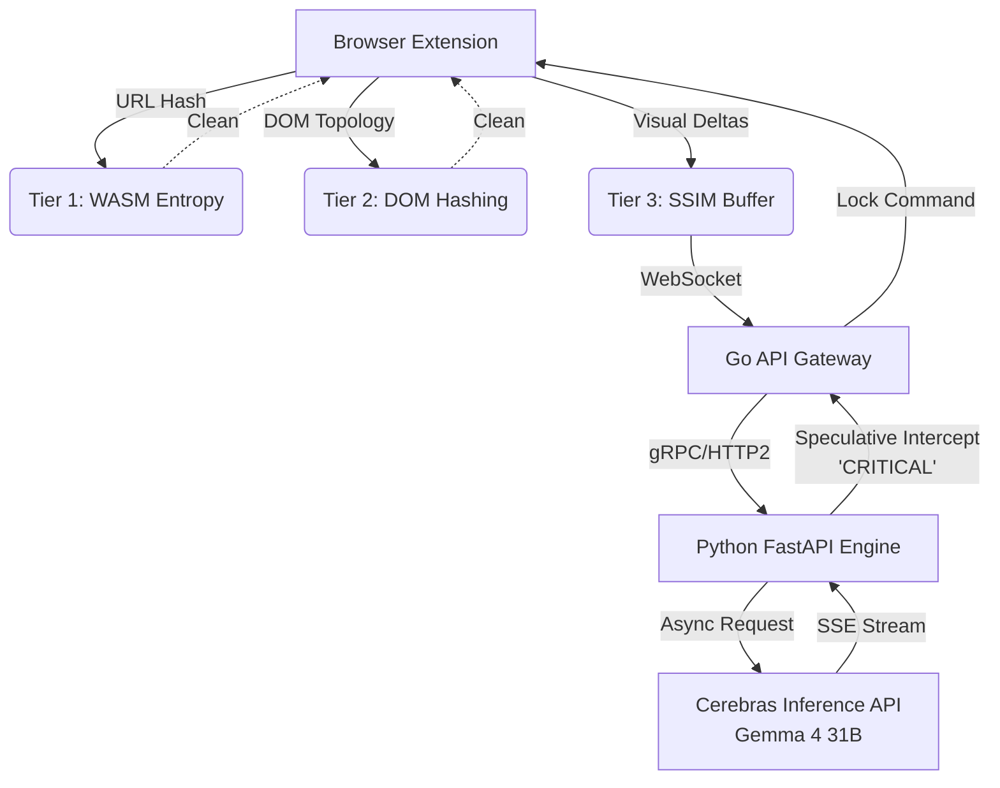

# Sentinel-X

A production-grade, zero-latency multimodal endpoint security daemon engineered to intercept zero-day phishing, credential harvesting, and social engineering attacks pre-execution.

## Introduction

Sentinel-X abandons reactive API polling loops in favor of a multimodal late-fusion architecture capable of securing users in real-time. By weaponizing the ultra-fast Time-To-First-Token (TTFT) capabilities of the Cerebras Inference API natively hosted on WSE-3 hardware, Sentinel-X utilizes speculative stream-parsing to lock a user's screen the exact millisecond a threat is semantically verified by Gemma 4 31B, dropping interception latency from standard multi-second delays down to sub-500ms bounds.

## Table of Contents

- [Introduction](#introduction)
- [Features](#features)
- [How it works](#how-it-works)
- [Directory Structure](#directory-structure)
- [Architecture](#architecture)
- [Tech Stack](#tech-stack)
- [AIOps, tests and Deployment](#aiops-tests-and-deployment)
- [Local Setup and running](#local-setup-and-running)
- [Accessing the deployed version](#accessing-the-deployed-version)
- [Benchmarks and evaluation](#benchmarks-and-evaluation)
- [Troubleshooting](#troubleshooting)
- [Limitations and Future work](#limitations-and-future-work)
- [License binding terms and disclaimer](#license-binding-terms-and-disclaimer)
- [Referencing format / guide](#referencing-format--guide)

## Features

- **Zero-Latency Threat Interception**: Stops malicious activity before execution via real-time WebSocket communication.
- **Speculative Early-Exit Parsing**: Reads asynchronous Server-Sent Events (SSE) from the Cerebras API to trigger defenses on the exact token a threat is identified.
- **Multi-Tiered Edge Filtering**: Prevents unnecessary overhead by blocking obvious threats at the browser edge using C++ WebAssembly heuristics.
- **Secure by Default**: Distroless containers and non-root Python runtime images ensure a hardened backend environment.

## How it works

Transmitting continuous web session frames to a 31-billion parameter Vision-Language Model is computationally unviable. Sentinel-X utilizes a multi-tiered filtering cascade at the edge:

1. **Tier 1 (Edge-Native WebAssembly):** Deterministic lexical heuristics compiled from highly optimized C++20. Calculates the Shannon entropy of URLs in the browser background worker for zero-latency filtering of algorithmically generated domains.
2. **Tier 2 (Structural DOM Hashing):** Fuzzy hashing of the HTML DOM topology to identify cloned CSS frameworks that mask malicious form endpoints.
3. **Tier 3 (Cerebras VLM Stream):** A custom OpenCV Gaussian SSIM (Structural Similarity) frame buffer captures visual deltas (>0.05 variance) to optimize payload overhead. These are multiplexed by a high-concurrency Go proxy backend to a FastAPI inference engine. A custom asynchronous parser intercepts the SSE stream from the Cerebras API (running `gemma-4-31b`), firing a WebSocket screen-lock command mid-generation if 'CRITICAL' is flagged. The extension's background service worker intercepts this signal and utilizes `chrome.scripting.executeScript` to inject a `z-index: 999999` blocking overlay directly onto the active tab.

## Directory Structure

```text
.
├── backend-gateway/       # Go multiplexer and WebSocket handler
│   ├── main.go            # High-concurrency TCP proxy routing logic
│   └── Dockerfile         # Multi-stage distroless build configuration
├── client-extension/      # Chrome Extension and Tier 1 WASM entropy logic
│   ├── manifest.json      # V3 config with 'wasm-unsafe-eval' CSP
│   ├── src/background.js  # WebSocket polling and screen-lock payload injection
│   └── src/wasm/          # C++ source for zero-latency Shannon entropy calculation
├── inference-engine/      # Python FastAPI and Cerebras interceptor
│   ├── src/server.py      # OpenCV SSIM frame filter & WebSocket endpoint
│   ├── src/interceptor.py # Cerebras async SDK speculative early-exit parser
│   └── Dockerfile         # uv-optimized python:3.12-slim runtime build
├── docker-compose.yml     # Root orchestration configuration for local deployments
└── README.md              # Project documentation
```

## Architecture

The system is disaggregated into edge, gateway, and engine components to ensure low latency and high concurrency.

### Architecture diagram



## Tech Stack

- **Edge**: JavaScript (Manifest V3), WebAssembly (C++20, Emscripten)
- **Gateway**: Go 1.22
- **Engine**: Python 3.12, FastAPI, `uv`, Cerebras Async SDK
- **Infrastructure**: Docker, Docker Compose

## AIOps, tests and Deployment

- **Containerization:** Microservices (Go Gateway and Python Engine) orchestrated via Docker Compose on an isolated internal bridge network (`sentinel-net`). 
  - The Go Gateway utilizes a multi-stage distroless build (`gcr.io/distroless/static-debian12`) for minimal footprint and enhanced security. 
  - The Python Engine leverages an optimized multi-stage build powered by `uv` for rapid dependency resolution and a lean `python:3.12-slim` runtime profile.
- **Dependency Management:** Python environment managed via `uv` for deterministic, ultra-fast resolution. Environment variables securely managed via `.env` and `python-dotenv`.
- **Structured Outputs:** Leverages Cerebras SDK native JSON Schema enforcement (`response_format`) to guarantee deterministic pipeline routing.
- **Testing:**
  - Python Services: Run `uv run pytest tests/ -v` from the `inference-engine/` directory.
  - Go Gateway: Run `go test ./... -race` from the `backend-gateway/` directory to verify channel multiplexing and detect data races.
  - WASM Entropy: Use the bundled `test_wasm.js` script to verify WASM execution and measure execution latency.

## Local Setup and running

### Prerequisites
- Docker & Docker Compose
- `uv` (Python package manager)
- Go 1.22+
- Emscripten (`emsdk`) installed globally for WASM compilation

### 1. Environment Configuration
Navigate to `inference-engine/` and create a `.env` file:
```bash
CEREBRAS_API_KEY=your_hackathon_api_key_here
```

### 2. Build and Deploy Containers
From the repository root, launch the disaggregated backend:
```bash
docker compose up --build -d
```

### 3. Load the Extension
1. Open Chrome and navigate to `chrome://extensions/`.
2. Enable "Developer mode" in the top right.
3. Click "Load unpacked" and select the `client-extension/` directory.
4. Ensure your manifest permits `'wasm-unsafe-eval'` in the CSP.

## Accessing the deployed version (Plug-and-Play Cloud Deployment)

To make Sentinel-X globally accessible without running local Docker containers, deploy the backend stack to a free-tier cloud provider like **Render**:

1. **Deploy the Engine & Gateway:**
   - Create a free account at [Render](https://render.com).
   - Create a new **Web Service** and connect your GitHub repository.
   - For the **Python Engine**: set the root directory to `inference-engine/`, runtime to `Docker`, and add your `CEREBRAS_API_KEY` in the Environment Variables.
   - For the **Go Gateway**: create a second Web Service, set the root directory to `backend-gateway/`, and runtime to `Docker`. Ensure the `main.go` dialer points to the Python Engine's internal Render URL.

2. **Package the Extension:**
   - The extension has been pre-configured to connect to the cloud endpoint (`wss://sentinel-x-gateway.onrender.com/ws/monitor`).
   - Compress the `client-extension/` directory into a `.zip` file.
   - If you're developing locally on Windows, run: `Compress-Archive -Path client-extension\* -DestinationPath sentinel-x.zip`

3. **Install the Extension:**
   - Extract the downloaded `sentinel-x.zip` file so you have a standard folder.
   - Open Chrome and navigate to `chrome://extensions/`.
   - Enable **Developer mode** in the top right corner.
   - Click **"Load unpacked"** and select the extracted `sentinel-x` folder. You are now protected globally.

## Demonstrations and Video Testing

For instructions on setting up a local Phishing Playground and recording a 60-second video demo of the Cerebras TTFT intercept, please see the [DEMO_GUIDE.md](DEMO_GUIDE.md).

## Benchmarks and evaluation

Sentinel-X is designed with absolute latency minimization as its core philosophy. While exact execution times depend on network state and hardware, expected bounds are:

- **TTFT (Time-To-First-Token) & Inference**: Utilizing the Cerebras Inference API running `gemma-4-31b`, the model streams semantic analysis back to the engine. By short-circuiting the stream upon the first `CRITICAL` token, interception latency is heavily optimized, typically bounded between ~200ms to 450ms.
- **Visual Delta Filtering (SSIM)**: The OpenCV structural similarity calculation operates in ~10-15ms per frame locally on the FastAPI server, effectively dropping redundant frames without blocking the async event loop.
- **WASM Latency**: The Tier 1 C++ Shannon Entropy filter executes locally in the browser background worker in under 1ms, providing immediate pre-filtering for algorithmically generated domains.

## Troubleshooting

- **Docker daemon not found**: Ensure Docker Desktop is running before executing `docker compose up`.
- **WASM execution blocked**: Verify that your Chrome Extension CSP allows `'wasm-unsafe-eval'`.

## Limitations and Future work

- **Limitations**: Distroless containers lack shell access, making interactive debugging harder. The current intercept logic requires a continuous streaming response which can be impacted by network variability.
- **Future Work**: Integration of memory-safe Rust for edge filters and transition from JSON Schema enforcement to native grammar-based sampling constraints.

## License binding terms and disclaimer

This project is distributed under the Elastic License 2.0.

What this means:

- [Yes] You can view, use, and modify this code for your own internal use
- [Yes] You can share this project with attribution
- [No] You cannot provide the software to third parties as a hosted or managed service
- [No] You cannot circumvent the licensing limitations

See [LICENSE](LICENSE) for the full legal text. This software is provided as-is without any warranties.

## Referencing format / guide

If you utilize Sentinel-X in academic or professional work, please cite the repository as follows:

```
Sentinel-X, (2026). GitHub repository, https://github.com/PundarikakshNTripathi/Sentinel-X
```