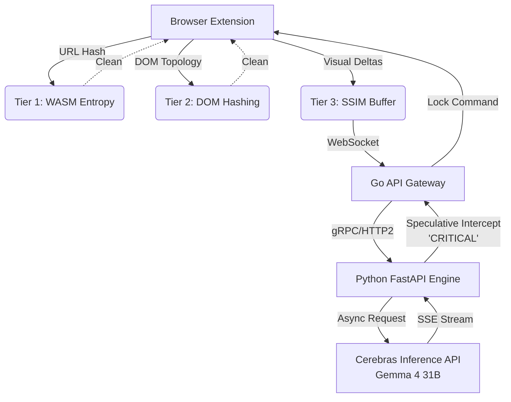

# Sentinel-X

> A production-grade, zero-latency multimodal endpoint security daemon engineered to intercept zero-day phishing, credential harvesting, and social engineering attacks pre-execution.

[](https://opensource.org/licenses/Apache-2.0)
[]()
[](https://golang.org/)
[](https://python.org/)

Sentinel-X abandons reactive API polling loops in favor of a multimodal late-fusion architecture capable of securing users in real-time. By weaponizing the ultra-fast Time-To-First-Token (TTFT) capabilities of the Cerebras Inference API natively hosted on WSE-3 hardware, Sentinel-X utilizes speculative stream-parsing to lock a user's screen the exact millisecond a threat is semantically verified by Gemma 4 31B—dropping interception latency from standard multi-second delays down to sub-500ms bounds.

---

## 🏗 Architectural Cascade Framework

Transmitting continuous web session frames to a 31-billion parameter Vision-Language Model is computationally unviable. Sentinel-X utilizes a multi-tiered filtering cascade at the edge:

1. **Tier 1 (Edge-Native WebAssembly):** Deterministic lexical heuristics compiled from highly optimized C++20. Calculates the Shannon entropy of URLs in the browser background worker for zero-latency filtering of algorithmically generated domains.
2. **Tier 2 (Structural DOM Hashing):** Fuzzy hashing of the HTML DOM topology to identify cloned CSS frameworks that mask malicious form endpoints.
3. **Tier 3 (Cerebras VLM Stream):** A sliding Structural Similarity Index Measure (SSIM) frame buffer captures visual deltas. These are multiplexed by a high-concurrency Go backend to a FastAPI inference engine. A custom asynchronous parser intercepts the Server-Sent Event (SSE) stream from the Cerebras API, firing a WebSocket screen-lock command mid-generation.

### Architecture Diagram



---

## ⚙️ AIOps & Deployment

- **Containerization:** Microservices (Go Gateway and Python Engine) orchestrated via Docker Compose on an isolated internal bridge network (`sentinel-net`). 
  - The **Go Gateway** utilizes a multi-stage distroless build (`gcr.io/distroless/static-debian12`) for minimal footprint and enhanced security. 
  - The **Python Engine** leverages an optimized multi-stage build powered by `uv` for rapid dependency resolution and a lean `python:3.12-slim` runtime profile.
- **Dependency Management:** Python environment managed via `uv` for deterministic, ultra-fast resolution. Environment variables securely managed via `.env` and `python-dotenv`.
- **Structured Outputs:** Leverages Cerebras SDK native JSON Schema enforcement (`response_format`) to guarantee deterministic pipeline routing without hallucinated schemas.

---

## 🚀 Quickstart & Setup

### Prerequisites
- Docker & Docker Compose
- `uv` (Python package manager)
- Go 1.22+
- Emscripten (`emsdk`) installed globally for WASM compilation

### 1. Environment Configuration
Navigate to `inference-engine/` and create a `.env` file:
```bash
CEREBRAS_API_KEY=your_hackathon_api_key_here
```

### 2. Build and Deploy Containers
From the repository root, launch the disaggregated backend:
```bash
docker compose up --build -d
```

### 3. Load the Extension
1. Open Chrome and navigate to `chrome://extensions/`.
2. Enable "Developer mode" in the top right.
3. Click "Load unpacked" and select the `client-extension/` directory.
4. Ensure your manifest permits `'wasm-unsafe-eval'` in the CSP.

---

## 🧪 Testing and Verification

- **Python Services**: Run `uv run pytest tests/ -v` from the `inference-engine/` directory.
- **Go Gateway**: Run `go test ./... -race` from the `backend-gateway/` directory to verify channel multiplexing and detect data races.
- **WASM Entropy**: Use the bundled `test_wasm.js` script to verify WASM execution and measure execution latency.

---
*Built with ❤️ for the Gemma 4 X Cerebras Hackathon.*